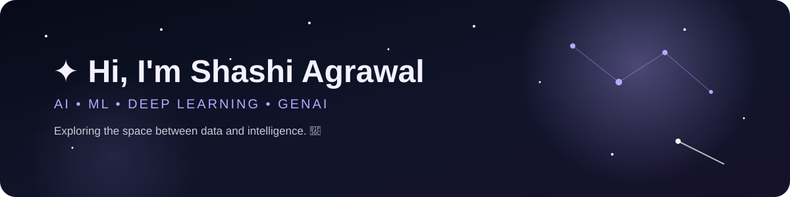

✦ Hi, I'm Shashi Agrawal

AI/ML Engineer in Progress · Deep Learning · Generative AI

Turning data into intelligent systems.

 
---

🔭 About Me

I'm a Computer Science student passionate about Artificial Intelligence, Machine Learning, Deep Learning, Data Science, and Generative AI.

I enjoy transforming ideas into practical projects — from traditional machine learning models and data analysis to neural networks, reinforcement learning, NLP, and modern AI systems.

«My goal: Keep learning, keep building, and turn intelligent ideas into real-world solutions. 🚀»

✦ Current Focus

- 🧠 Deep Learning & Neural Networks
- 🤖 Generative AI & Large Language Models
- 📊 Machine Learning & Data Science
- 🎮 Reinforcement Learning
- 🗣️ Natural Language Processing
- 🧪 Building practical AI/ML projects
- 🚀 Exploring modern AI technologies

---

🌠 My Learning Journey

                    ┌─────────────────┐
                    │      DATA       │
                    └────────┬────────┘
                             ↓
                    ┌─────────────────┐
                    │ MACHINE LEARNING│
                    └────────┬────────┘
                             ↓
                    ┌─────────────────┐
                    │  DEEP LEARNING  │
                    └────────┬────────┘
                             ↓
                    ┌─────────────────┐
                    │ REINFORCEMENT   │
                    │    LEARNING     │
                    └────────┬────────┘
                             ↓
                    ┌─────────────────┐
                    │   GENERATIVE AI │
                    └────────┬────────┘
                             ↓
                    ┌─────────────────┐
                    │ INTELLIGENT AI  │
                    │     SYSTEMS     │
                    └─────────────────┘

---

🧠 AI / ML Projects

A selection of projects where I apply machine learning, deep learning,
reinforcement learning, NLP, and AI concepts to practical problems.

✦ Signature Recognition System

A machine learning system for distinguishing genuine and forged signatures
using sequential signature data and feature engineering.

Tech: "Python" · "Scikit-learn" · "PyTorch" · "Pandas" · "NumPy"

---

✦ MountainCar — Q-Learning

A reinforcement learning project implementing Q-Learning to train an
agent to solve the MountainCar environment.

Concepts: "Q-Learning" · "State Discretization" · "Q-Table"
· "Exploration vs Exploitation"

Tech: "Python" · "Gymnasium" · "NumPy"

---

✦ Flappy Bird — Deep Q-Learning

A reinforcement learning project exploring Deep Q-Networks (DQN),
experience replay, and neural-network-based decision making.

Concepts: "DQN" · "Experience Replay" · "Neural Networks"
· "Reinforcement Learning"

Tech: "Python" · "PyTorch"

---

✦ IMDB Sentiment Analyzer

An NLP project for classifying movie reviews based on their sentiment
using text preprocessing and machine learning techniques.

Tech: "Python" · "NLP" · "Scikit-learn" · "Pandas"

---

✦ Spam Detector

A machine learning project for detecting spam messages using
text-based features and classification techniques.

Tech: "Python" · "NLP" · "Scikit-learn"

---

✦ House Price Predictor

A regression-based machine learning project for predicting house prices
from relevant property features.

Tech: "Python" · "Pandas" · "Scikit-learn" · "Matplotlib"

---
🧪 Reinforcement Learning Lab
Current RL Projects

- 🎯 CliffWalking — Q-Learning & SARSA
- 🚗 MountainCar — Q-Learning with State Discretization
- 🐦 Flappy Bird — Deep Q-Networks & Experience Replay

---

🛠️ Tech Stack

👨‍💻 Programming Languages

🧠 AI Concepts

🌐 Development & Tools

---

🌌 Beyond the Code

                    ┌─────────────┐
                    │    LEARN    │
                    └──────┬──────┘
                           ↓
                    ┌─────────────┐
                    │    BUILD    │
                    └──────┬──────┘
                           ↓
                    ┌─────────────┐
                    │ EXPERIMENT  │
                    └──────┬──────┘
                           ↓
                    ┌─────────────┐
                    │   IMPROVE   │
                    └──────┬──────┘
                           ↓
                    ┌─────────────┐
                    │    REPEAT   │
                    └──────┬──────┘
                           │
                           └──────────→ 🚀

«“Learn something new. Build something useful. Break it. Fix it. Learn again.”»

---

📊 GitHub Analytics

  

---

🏆 GitHub Achievements

---

💡 Areas of Interest

"Artificial Intelligence" ·
"Machine Learning" ·
"Deep Learning" ·
"Generative AI" ·
"Large Language Models" ·
"Natural Language Processing" ·
"Reinforcement Learning" ·
"Data Science" ·
"Neural Networks" ·
"AI Applications"

---

🤝 Let's Connect

Interested in AI, ML, or building something interesting?

I'm always open to learning, collaborating, and working on meaningful
technology projects.

 
---

  

✦ Building today. Learning every day. Creating tomorrow. 🚀

Thanks for visiting my profile!

 ⭐ Explore my repositories and follow my journey into AI.

 "DATA" → "LEARNING" → "INTELLIGENCE" → "INNOVATION"

